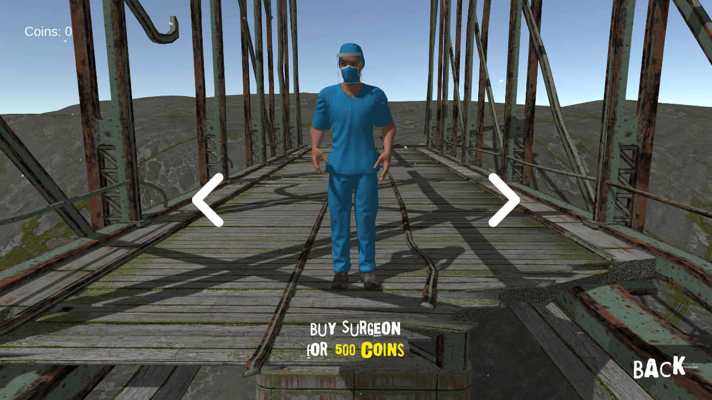

 

  
  <h3 align="center">LockDawn</h3>
  

    An Android-Based 3D Adventure Game In Understanding The Importance
       
      Of Safety Protocols For The COVID-19 Pandemic
  

 

## Abstract
LockDawn is an android-based 3D adventure game designed to teach people about the importance of following safety protocols during the COVID-19 pandemic. The game aims to remind users about safety measures both when they are outside and when they are at home. It provides basic information on using disinfectants and wearing personal protective equipment to protect against COVID-19. Through various situations, challenges, and game objectives, users will gain an understanding of why these safety protocols are crucial.

In the game, players must avoid getting close to infected zombies while completing tasks, similar to how individuals in real life must be cautious and avoid close contact with others during a pandemic. If players are careless and get too close to the infected zombies, they may face consequences such as being quarantined. During this time, they must wait to continue playing or they can choose to watch advertisements that provide educational information about COVID-19, including how the virus spreads.
 
 

## Purpose and Description
The proponents are developing a mobile video game called LockDawn for Android devices. The game's objective is to educate and entertain individuals aged 18 to 25 about the importance of safety protocols during the COVID-19 pandemic. By combining entertainment and education, the game aims to address the problem of people neglecting safety measures and lacking awareness of the true dangers of COVID-19.

The game will be designed to capture the attention of the target age group, as video games are a popular form of entertainment, particularly among young people. By using the game as a tool, the proponents aim to create a realistic experience that reflects the challenges faced in real life. The choice of a mobile platform is ideal for reaching a wider audience, considering the large number of mobile users.

In addition to promoting safety protocols, the game will also incorporate the concept of vaccination, showcasing its purpose and benefits when a new virus threatens the country. The game will require specific hardware specifications to ensure smooth installation and gameplay. It will feature a storyline and a mix of puzzle genres to enhance players' skills, with a touch of horror to make it more engaging.

Studies suggest that playing video games can improve learning and memory, making them more effective than simply reading articles or watching visualizations about COVID-19 safety protocols. Video games have the advantage of immersing players in relatable real-life situations and providing information on the effectiveness of safety measures. Moreover, video games have various health benefits and different genres that add challenge and enjoyment to players' lives.

Overall, LockDawn aims to leverage the power of video games to educate and engage players, encouraging them to follow safety protocols and stay informed about the COVID-19 pandemic.
 
 

## Screenshots

 </a>
 </a>
 </a>
 </a>
 </a>
 </a>
 </a>
 </a>
 </a>
 </a>
 </a>
 </a>
 </a>
 </a>

 

## Built with
* 
* 
* 
* 
* 
 

## Additional Notes

The LockDawn repository is no longer up to date due to an error during the git-lfs upload process in my GitHub Desktop. Unfortunately, I forgot to enable git-lfs before adding large assets, resulting in outdated Assets Files and other related content. However, I have uploaded the latest and complete script in a separate repository to keep this repository clean and organized.
 

Link: [https://github.com/edzenfrance/LockDawn-Completed-Script](https://github.com/edzenfrance/LockDawn-Completed-Script)
 
 

## Acknowledgement

* [Unity](https://unity.com)
* [Unity Forum](https://forum.unity.com)
* [SketchFab](https://sketchfab.com)
* [Mixamo](https://www.mixamo.com)
* [MakeHuman](http://www.makehumancommunity.org)
* [PlayFab](https://playfab.com)
* [Lovo](https://lovo.ai)
* [Kenney](https://www.kenney.nl)
* [Freesound](https://freesound.org)
* [FreePik](https://www.freepik.com)
* [Unsplash](https://unsplash.com)
* [Visual Studio](https://visualstudio.microsoft.com)
* [Github Desktop](https://desktop.github.com)
* [Godot](https://godotengine.org)
* [Blender](https://www.blender.org)

